<picture>
  <source media="(prefers-color-scheme: dark)" srcset="assets/village-night.svg">
  
</picture>

Hi, I'm Bambang, a Computer Science student at BINUS Bandung. I work where the model meets the person using it: the last mile between something that runs in a notebook and something a person can actually open and use.

Once something stops being new I get restless. For a long time I read that as a flaw, until I noticed that a field which never sits still is a good place for someone like that.

This profile is laid out like a small village. Every building is something I made.

<table>
  <tr>
    <td width="72"><picture><source media="(prefers-color-scheme: dark)" srcset="assets/kitchen-night.svg"></picture></td>
    <td><b>The kitchen · <a href="https://camilan-roemah.bambangaranayas.workers.dev">Camilan Roemah</a></b> An online store for my family's home kitchen in Bandung. There is no stock to sell, only cooking batches, so the site is built around that. Designed and built solo, live on Cloudflare Workers.</td>
  </tr>
  <tr>
    <td><picture><source media="(prefers-color-scheme: dark)" srcset="assets/school-night.svg"></picture></td>
    <td><b>The schoolhouse · <a href="https://github.com/FadhRach/ThinkPath">ThinkPath</a></b> An academic integrity platform for Indonesian lecturers. It reads how a piece of writing happened instead of handing out verdicts. Team DataDigger, GEMASTIK 2026 finalist.</td>
  </tr>
  <tr>
    <td><picture><source media="(prefers-color-scheme: dark)" srcset="assets/library-night.svg"></picture></td>
    <td><b>The library · two papers</b> Sentiment analysis for Sundanese, where the usual text cleaning turned out to hurt the model, and market regime classification on IDX blue chips. Both presented at ICORIS 2026. I ran the experiments.</td>
  </tr>
  <tr>
    <td><picture><source media="(prefers-color-scheme: dark)" srcset="assets/clinic-night.svg"></picture></td>
    <td><b>The clinic · <a href="https://github.com/Bambang-Saputra/ml-disease-risk-prediction">HealthGuard</a></b> Four disease risk models turned into an 18-question check anyone can fill in. My part was the backend and the deploy. Next door is <a href="https://github.com/Bambang-Saputra/Blood-Connect">Blood Connect</a>, a donor platform where I did the research, not the code.</td>
  </tr>
  <tr>
    <td><picture><source media="(prefers-color-scheme: dark)" srcset="assets/quest-night.svg"></picture></td>
    <td><b>The quest board · <a href="https://github.com/Bambang-Saputra/life-sim-dashboard">Life-Sim Dashboard</a></b> Every to-do app bored me after three days, so I made one where tasks are RPG quests, money is a gold ledger, and the pixel farm on top knows what time it is. Laravel, Livewire, Tailwind.</td>
  </tr>
  <tr>
    <td><picture><source media="(prefers-color-scheme: dark)" srcset="assets/shed-night.svg"></picture></td>
    <td><b>The tool shed · what I build with</b> 
      <b>Languages</b> Python, PHP, JavaScript, TypeScript, SQL 
      <b>Web</b> Laravel, Livewire, Alpine.js, Tailwind CSS, Next.js, React, FastAPI 
      <b>Data and ML</b> pandas, scikit-learn, XGBoost, IndoBERT, SHAP, Jupyter 
      <b>Shipping and design</b> Cloudflare Workers, Railway, MySQL, Git, Figma 
      Only tools that sit behind a project above.</td>
  </tr>
  <tr>
    <td><picture><source media="(prefers-color-scheme: dark)" srcset="assets/hobbies-night.svg"></picture></td>
    <td><b>The bookshop and the cinema · off the clock</b> Manhwa, comics, anime, films. Enough of them that the quest board ended up with its own watchlist. Also a camera, a guitar, and a piano I keep coming back to.</td>
  </tr>
  <tr>
    <td><picture><source media="(prefers-color-scheme: dark)" srcset="assets/field-night.svg"></picture></td>
    <td><b>The field · still growing</b> Django is next. Meanwhile, Public Relations Manager at BNCC, which is where most of my event photos come from.</td>
  </tr>
</table>

**Come by:** [bambangsaputra.vercel.app](https://bambangsaputra.vercel.app) · [LinkedIn](https://www.linkedin.com/in/bambang-aranaya-saputra-4a42b7325/) · bambangaranayas@gmail.com

The village is drawn in code, one rectangle at a time. It switches to night when GitHub is in dark mode.
