<picture>
  <source media="(prefers-color-scheme: dark)" srcset="assets/village-night.svg">
  
</picture>

<h3 align="center">I work where the model meets the person using it.</h3>

CS student at BINUS Bandung · Python for data and ML · Laravel and JavaScript for the web

<table align="center">
  <tr>
    <td width="260" align="center" valign="top">
      <picture><source media="(prefers-color-scheme: dark)" srcset="assets/school-night.svg"></picture> 
      <b><a href="https://github.com/FadhRach/ThinkPath">ThinkPath</a></b> 
      GEMASTIK 2026 FINALIST  
      An integrity tool for lecturers that reads how the writing happened.
    </td>
    <td width="260" align="center" valign="top">
      <picture><source media="(prefers-color-scheme: dark)" srcset="assets/library-night.svg"></picture> 
      <b>Two papers</b> 
      PRESENTED AT ICORIS 2026  
      Sundanese sentiment analysis and IDX market regimes. I ran the experiments.
    </td>
    <td width="260" align="center" valign="top">
      <picture><source media="(prefers-color-scheme: dark)" srcset="assets/kitchen-night.svg"></picture> 
      <b><a href="https://camilan-roemah.bambangaranayas.workers.dev">Camilan Roemah</a></b> 
      LIVE  
      An online store for my family's kitchen in Bandung. Designed and built solo.
    </td>
  </tr>
</table>

  <a href="https://bambangsaputra.vercel.app"><b>Portfolio</b></a> ·
  <a href="https://www.linkedin.com/in/bambang-aranaya-saputra-4a42b7325/"><b>LinkedIn</b></a> ·
  <a href="mailto:bambangaranayas@gmail.com"><b>Email</b></a>

Off the clock: manhwa, anime, a camera and a guitar. More projects in the pins below.

